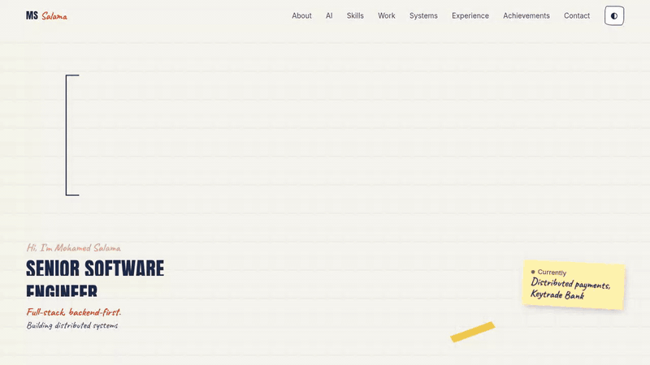
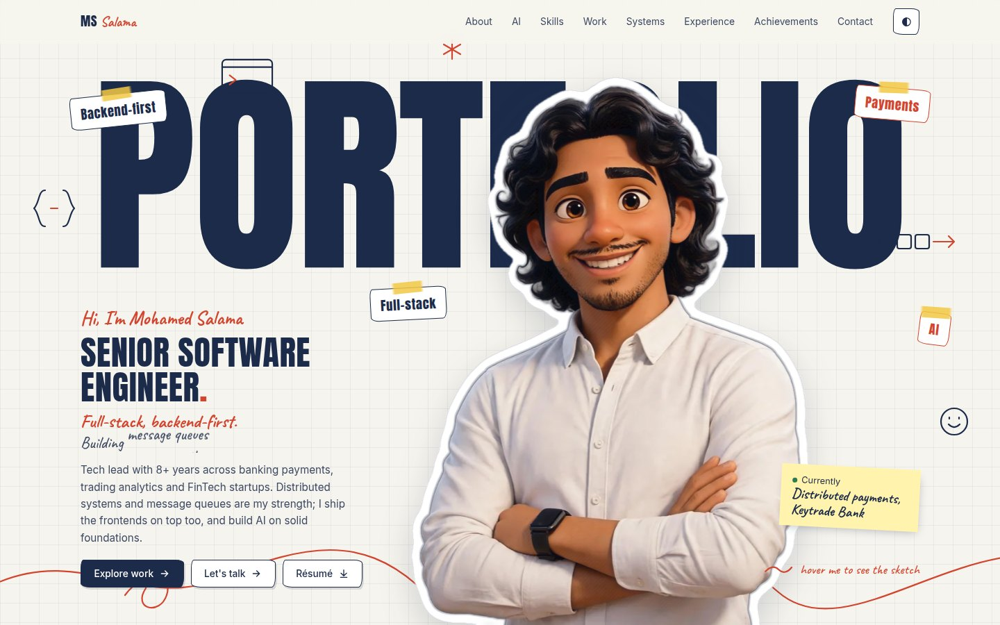
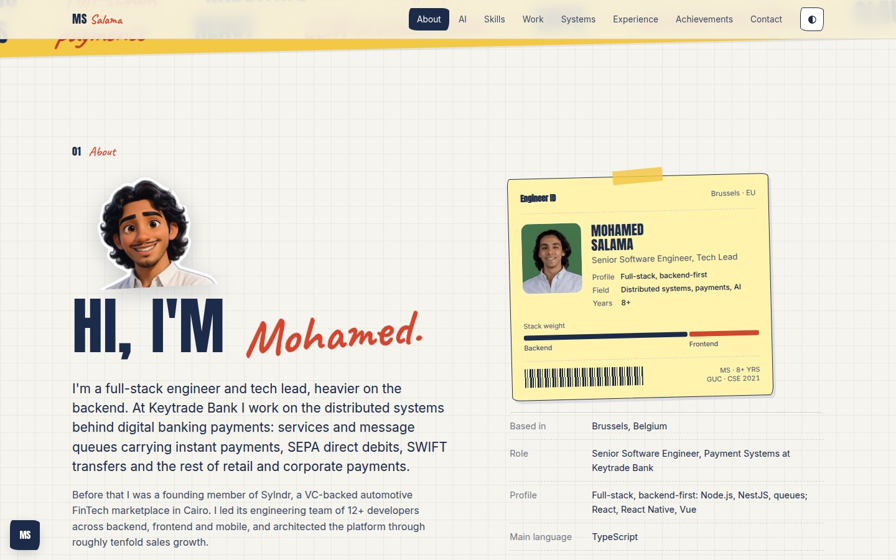
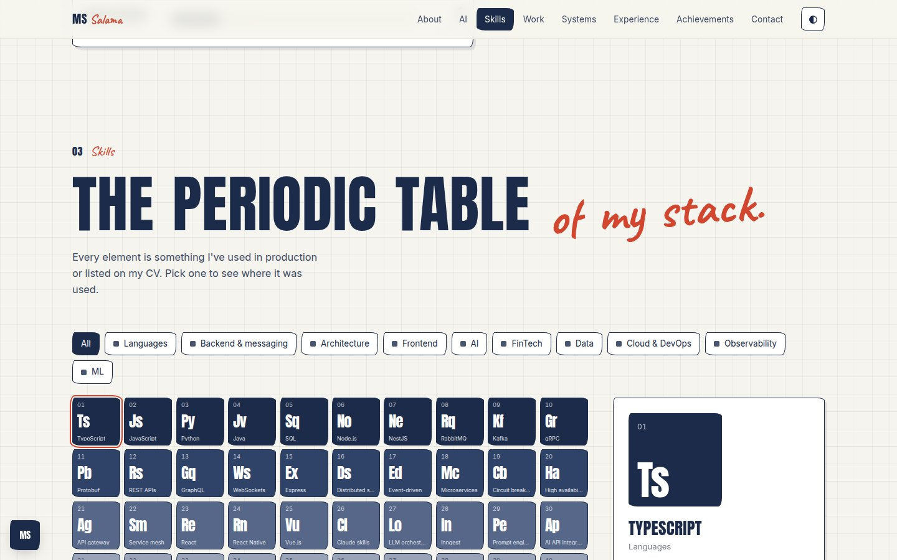
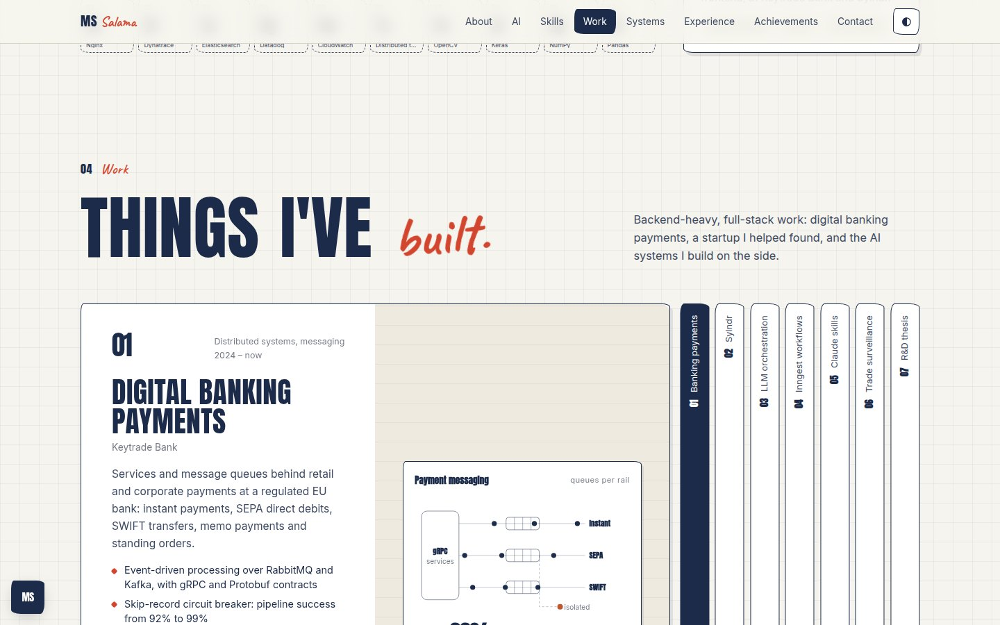
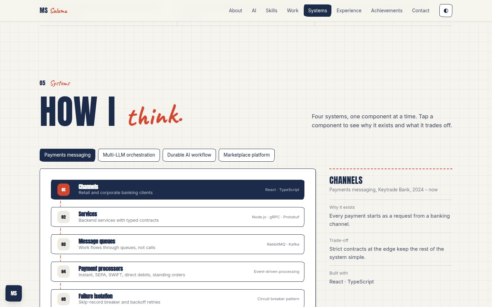
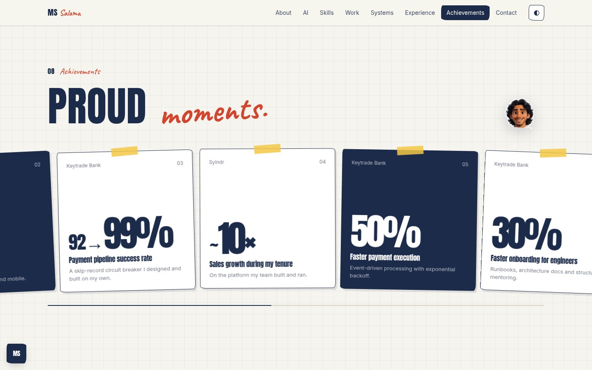
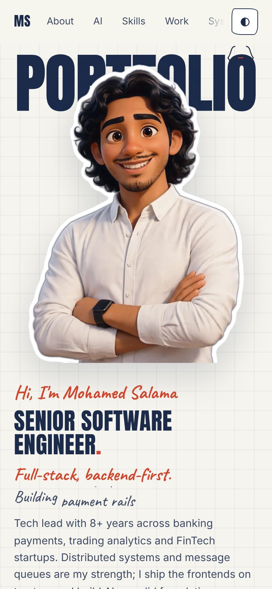
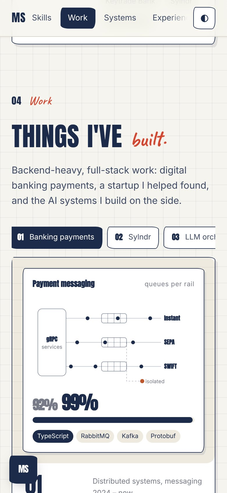
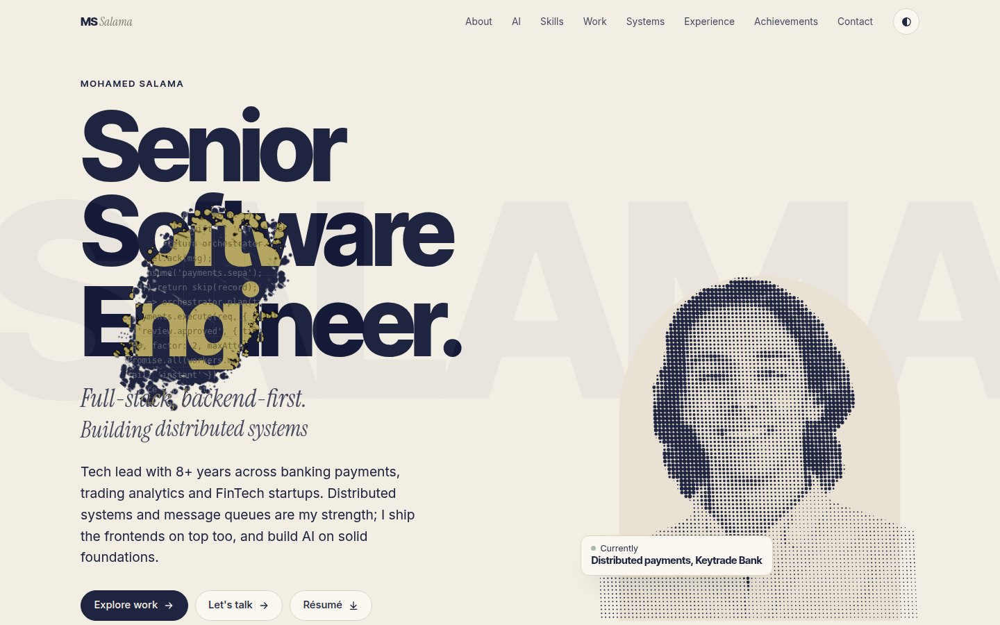

# Mohamed Salama — Portfolio

<p align="center">
  <a href="https://madoooaboelazaiem.github.io/portfolio/"></a>
</p>

<p align="center">
  <a href="https://github.com/madoooaboelazaiem/portfolio/actions/workflows/pages.yml"></a>
  <a href="https://madoooaboelazaiem.github.io/portfolio/"></a>
  
  <a href="LICENSE"></a>
</p>

An interactive portfolio built from a CV. One self-contained HTML file per theme: no framework, no bundler, no external JavaScript. Every word on the page comes from [`site/content.json`](site/content.json), so updating it means editing text, not code.

**Live:** [https://madoooaboelazaiem.github.io/portfolio/](https://madoooaboelazaiem.github.io/portfolio/) · **Editorial theme:** [https://madoooaboelazaiem.github.io/portfolio/editorial/](https://madoooaboelazaiem.github.io/portfolio/editorial/)

## Contents

- [What's inside](#whats-inside)
- [Preview](#preview)
- [Quick start](#quick-start)
- [Editing the content](#editing-the-content)
- [Replacing the images](#replacing-the-images)
- [Project structure](#project-structure)
- [Deploy to GitHub Pages](#deploy-to-github-pages)
- [Showcase it on GitHub](#showcase-it-on-github)
- [Before you publish: privacy checklist](#before-you-publish-privacy-checklist)
- [Customising](#customising)
- [How it works](#how-it-works)
- [Troubleshooting](#troubleshooting)
- [Using it with Claude](#using-it-with-claude)
- [Credits](#credits) · [License](#license)

## What's inside

| Section | What it does |
|---|---|
| **Hero** | Giant outlined word, a 3D character that draws itself in pencil then colours in, doodles, taped labels. Hovering erases the colour back to pencil. |
| **About** | Short bio, a sticky-note ID card with a stack-weight bar, quick facts. |
| **AI** | Live demo of orchestrator-to-worker model routing, and polling versus a durable workflow. Optional. |
| **Skills** | Periodic table of the stack. Filter by group, click an element to see where it was used. |
| **Work** | Project carousel with a hand-built animated mockup per project and expandable case notes. |
| **Systems** | Clickable architecture flows: why each component exists and what it trades off. Optional. |
| **Experience** | Year rail and detail panel, newest first. |
| **Achievements** | Pinned horizontal scroll of taped cards with count-up numbers. |
| **Contact** | Email, links, résumé download. |

Two themes from the same content:

| | Sketchbook (main) | Editorial |
|---|---|---|
| URL | `/` | `/editorial/` |
| Look | Graph paper, tape, doodles, Anton and Caveat | Cream and navy magazine, Inter Tight and Instrument Serif |
| Hero | Character sketches itself, hover erases to pencil | Halftone portrait; scratch it to reveal code, queues and the character, which looks at the cursor |

Also: light and dark themes, a built-in [content editor](#editing-the-content), respect for `prefers-reduced-motion`, and a keyboard-friendly layout with a skip link and visible focus.

## Preview

<table>
  <tr>
    <td></td>
    <td></td>
  </tr>
  <tr>
    <td></td>
    <td></td>
  </tr>
  <tr>
    <td></td>
    <td></td>
  </tr>
</table>

<table>
  <tr>
    <td width="25%"></td>
    <td width="25%"></td>
    <td width="50%"></td>
  </tr>
</table>

## Quick start

Requires Python 3.9+. No Node.

```bash
git clone https://github.com/madoooaboelazaiem/portfolio.git
cd portfolio
python3 -m venv .venv && source .venv/bin/activate
pip install -r requirements.txt

make serve        # builds dist/ and serves http://localhost:8000
```

No `make` (Windows)? These two commands are all it runs:

```bash
python scripts/build.py --content site/content.json --photo assets/photo.png --card assets/card.png --avatar assets/avatar.png --cv assets/cv.pdf --theme sketch --out dist/index.html
python scripts/build.py --content site/content.json --photo assets/photo.png --card assets/card.png --avatar assets/avatar.png --cv assets/cv.pdf --theme editorial --out dist/editorial/index.html
```

| Command | Does |
|---|---|
| `make build` | Builds `dist/index.html` (sketchbook) and `dist/editorial/index.html` |
| `make serve` | Build, then serve on port 8000 |
| `make check` | Validates `site/content.json` (catches a missing comma or a bad field), then warns about phone numbers in public files |
| `make qa` | Screenshots every section on desktop and mobile; reports JS errors and horizontal overflow (needs `requirements-dev.txt`) |
| `make showcase` | Regenerates the README GIF, screenshots and social-preview image (needs `requirements-dev.txt`, ffmpeg) |

## Editing the content

All copy lives in [`site/content.json`](site/content.json). The full field list is in [`docs/content-schema.md`](docs/content-schema.md). Delete a section's key (for example `"ai"` or `"systems"`) and that section and its menu link disappear.

**1. Edit in the browser, save on GitHub (no tools needed)**

1. Open your live site with `#edit` on the end: `https://madoooaboelazaiem.github.io/portfolio/#edit`
2. Change the JSON in the side panel and press **Preview** to see it.
3. Press **Copy JSON**.
4. On GitHub open `site/content.json`, click the pencil icon, paste over everything, **Commit changes**.
5. The workflow redeploys in about a minute.

> Anyone can open `#edit` on your live site, but what they type exists only in their own browser tab. Nothing changes on your site unless someone commits to this repository.

> **Download index.html** in the panel is for hosting the single file somewhere else. On GitHub Pages the site is rebuilt from `site/content.json` on every push, so a downloaded file is overwritten by the next deploy. Use **Copy JSON** here.

**2. Edit the file directly**

Change `site/content.json` in any editor, run `make serve` to check it, then commit and push.

**3. Ask Claude**

Paste your JSON and say what should change. With the [skill](#using-it-with-claude) installed, say "update my portfolio content".

Writing tips the template is built around:

- Headings are `["plain part", "red handwritten part"]`. Keep the second part to one or two words.
- Numbers (percentages, team sizes, years) should come from your CV. The achievement cards display them in very large type.
- Skills are ordered by weight: the first elements are the darkest tiles, so put your core stack first.

## Replacing the images

| File | What | Notes |
|---|---|---|
| `assets/avatar.png` | The 3D or illustrated character | **Transparent background**, half-body, head near the top. Drives the hero, About, Achievements and Contact stickers. The pencil version is generated from it automatically. |
| `assets/photo.png` | Real portrait | Transparent background. Used by the editorial theme's halftone hero. |
| `assets/card.png` | Small photo for the ID card | Optional; defaults to `photo.png`. |
| `assets/cv.pdf` | The résumé offered by every "Résumé" button | **Embedded in the page.** Delete the file to hide the buttons. |

Need a transparent background? `pip install -r requirements-dev.txt`, then `rembg i input.jpg assets/avatar.png`. Or use any background remover.

<details>
<summary>Prompt for generating the character (ChatGPT image or similar, with your photo as image 1)</summary>

```
Use my photo as the PRIMARY IDENTITY REFERENCE. Create a premium 3D animated-film style half-body portrait of me: preserve my exact face, hair, skin tone and proportions. Friendly confident smile, arms crossed, plain light shirt. Centred, looking at the camera, soft studio light, plain neutral grey background, no objects, no text. Portrait 4:5, high resolution.
```

More prompts (head-turn video for real cursor tracking, dark variant) are in [`docs/assets-and-prompts.md`](docs/assets-and-prompts.md).
</details>

After changing images, run `make showcase` to refresh the README screenshots and the social-preview image.

## Project structure

```
.
├── site/content.json            all site text: the one file you edit
├── assets/                      avatar.png, photo.png, card.png, cv.pdf
├── templates/                   template-sketch.html, template.html (editorial)
├── scripts/
│   ├── build.py                 content + images -> one HTML file
│   ├── capture_showcase.py      README GIF, screenshots, social preview
│   ├── qa.py                    screenshot and error checks
│   ├── validate_content.py      checks content.json before every build
│   ├── privacy_check.py         phone-number warning
│   ├── extract_cv_assets.py     pull text, links and photo out of a CV PDF
│   └── gh-setup.sh              create repo + enable Pages + push
├── docs/
│   ├── img/                     generated: hero.gif, screenshots, social-preview.png
│   ├── content-schema.md  design-system.md  motion.md  assets-and-prompts.md
│   └── profile-README.md        snippet for your GitHub profile
├── .github/workflows/pages.yml  build + deploy on every push to main
├── Makefile  requirements.txt  requirements-dev.txt  LICENSE
└── dist/                        build output (git-ignored, created by CI)
```

## Deploy to GitHub Pages

Free accounts need a **public** repository for Pages.

### Option A: one script (needs the [GitHub CLI](https://cli.github.com))

```bash
gh auth login        # once
./scripts/gh-setup.sh
```

It runs the privacy check, creates the repo, sets the description, website and topics, switches Pages to **GitHub Actions**, and pushes. Your site appears at `https://madoooaboelazaiem.github.io/portfolio/` after the first workflow run (about a minute). Watch it in the **Actions** tab.

### Option B: by hand

1. Create a new **public** repository on GitHub and push this folder to `main`.
2. **Settings → Pages → Build and deployment → Source: GitHub Actions.**
3. Open the **Actions** tab. If the first run failed because Pages wasn't enabled yet, press **Re-run all jobs**.
4. The URL appears on the run summary and under **Environments → github-pages**.

### How deployments work

Every push to `main` runs [`pages.yml`](.github/workflows/pages.yml): install Pillow and NumPy, validate `site/content.json`, run the privacy check, `make build`, upload `dist/`, deploy. If you break the JSON, the run fails with the line and column and the live site keeps serving the last good version. No secrets, no build cache to babysit. Pull requests don't deploy.

### Custom domain

1. **Settings → Pages → Custom domain**, enter it, save. Tick **Enforce HTTPS** once the certificate is ready.
2. At your DNS provider: for `www.example.com` add a `CNAME` to `madoooaboelazaiem.github.io`; for a bare domain add the `A` records listed in [GitHub's docs](https://docs.github.com/pages/configuring-a-custom-domain-for-your-github-pages-site).
3. **Settings → Secrets and variables → Actions → Variables → New:** `SITE_URL` = `https://www.example.com/` (trailing slash). This keeps the canonical URL and link-preview tags correct.

The same `SITE_URL` variable is needed if you name the repository `madoooaboelazaiem.github.io` (a user site served at the root).

### Link previews

The build writes Open Graph and Twitter card tags (title, description, `social-preview.png`), so pasting your URL into LinkedIn, Slack, WhatsApp or X shows a large card. These platforms cache previews: if you change the image, refresh them with LinkedIn's Post Inspector or Facebook's Sharing Debugger.

## Showcase it on GitHub

A checklist that turns the repo into something worth clicking:

- [ ] **About panel** (gear icon next to *About*): description, tick **Use your GitHub Pages website**, add topics. `gh-setup.sh` does this.
- [ ] **Social preview**: **Settings → General → Social preview → Edit → Upload** `docs/img/social-preview.png` (1280×640). This is the image shown when the repo link is shared. GitHub has no API for it, so it is manual.
- [ ] **Pin the repo** on your profile: profile page → **Customize your pins**.
- [ ] **Profile README**: create a repo named exactly `madoooaboelazaiem`, add a `README.md`, and paste [`docs/profile-README.md`](docs/profile-README.md). It shows the animated preview on your profile, linked to the live site.
- [ ] **Website link** in your GitHub profile settings, your LinkedIn *Featured* section and your email signature: `https://madoooaboelazaiem.github.io/portfolio/`.
- [ ] **README images**: run `make showcase` after any visual change so the GIF and screenshots match the live site.
- [ ] **Releases (optional)**: tag `v1.0.0` after a big redesign so there is a visible history.

Want others to reuse the design without your personal data? Don't make this repo a template. Fork it into a separate repo, replace `site/content.json` and `assets/` with placeholders, delete `docs/img/`, and mark that one as a **Template repository** (Settings → General).

## Before you publish: privacy checklist

This repository and the site are public. Check:

- [ ] **`assets/cv.pdf` is embedded in the page** and also lives in the repo. If your CV includes a phone number or home address, replace it with a public version, or delete the file (the Résumé buttons then disappear). `make check` and the workflow warn about phone numbers.
- [ ] **Email**: `person.email` is shown and linked on the page. Use an address you're happy to publish; scrapers will find it.
- [ ] **Photos**: `docs/img/` and `assets/` contain your likeness. Remove anything you don't want public.
- [ ] **Content**: everything in `site/content.json` is public, including employers, dates and figures. Check them against what your employers allow you to share.
- [ ] **Git history**: files you later delete remain in history. Fix problems before the first push, or recreate the repo.

## Customising

| To change | Edit |
|---|---|
| Colours | The `:root { … }` block near the top of `templates/template-sketch.html` (and the dark-theme blocks right after it) |
| Fonts | The Google Fonts `<link>` in `<head>` and the `--display` / `--serif` variables |
| Hero word, labels, hints | `hero.bigWord`, `hero.labels`, `hero.sketchHint` in `content.json` |
| Section order or a new section | The section markup in the template and the `ORDER` array in its script |
| A project's animated mockup | The `VIS` object in the template; see [`docs/motion.md`](docs/motion.md) |
| Design rules | [`docs/design-system.md`](docs/design-system.md) |

After editing a template, run `make qa` and look at the screenshots before pushing.

## How it works

- `scripts/build.py` reads `content.json`, generates the pencil sketch and die-cut sticker from `avatar.png`, base64-embeds images and the CV, and writes a single HTML file.
- At load, the page's JavaScript renders every section from the JSON stored in a `<script type="application/json" id="cv-content">` block. That block is what `#edit` modifies.
- The sketch drawing, scratch reveal and halftone are `<canvas>` animations; the avatar look-at (editorial theme) is a small WebGL shader with a static fallback.
- Output is under 500 KB per page with the CV embedded; the only external request is Google Fonts, with system-font fallbacks.
- Verified in Chromium (desktop and mobile viewports, zero JS errors, no horizontal overflow). It uses standard Canvas, CSS and ES2015 features that current Firefox and Safari support; if you hit a rendering bug there, please open an issue.

## Troubleshooting

| Problem | Fix |
|---|---|
| Site shows 404 | **Settings → Pages → Source** must be **GitHub Actions**, and the latest workflow run must be green. The repo must be public on free plans. |
| Workflow fails at *Deploy* with "Get Pages site failed" | Pages wasn't enabled when it first ran. Enable it, then **Re-run all jobs**. |
| Changed `content.json`, nothing changed on the site | Check the **Actions** tab for a green run, then hard-refresh (Cmd/Ctrl+Shift+R). |
| Link preview shows the old image | Platforms cache it. Use LinkedIn Post Inspector or Facebook Sharing Debugger. |
| Character has a jagged halo | `avatar.png` needs a clean cut-out at high resolution. Re-run `rembg i` on the original image. |
| Big hero word is cut off | Use a shorter `hero.bigWord` (it auto-fits, but very long words get small). |
| `#edit` panel says "JSON error" | A comma or quote is missing. The message gives the position. |
| Fonts look plain | Google Fonts was blocked or offline; the fallback fonts are used. |
| `make qa` or `make showcase` fails | `pip install -r requirements-dev.txt && playwright install chromium`; `make showcase` also needs `ffmpeg`. |

## Using it with Claude

This site is generated by the `cv-portfolio-site` Claude skill. With the skill installed you can say things like:

- "Turn this CV into a portfolio site" (attach the PDF and, optionally, a character image)
- "Update my portfolio: new role at X since March 2026"
- "Add this avatar and rebuild the sketch theme"
- "Scaffold the GitHub repo for it"

The skill extracts the text, links and photo from the CV, drafts `content.json` without inventing facts, builds, screenshots every section to check it, and flags anything suspicious (expired certifications, dates that don't add up).

## Credits

The interaction ideas (scratch reveal, cursor look-at, a self-drawing sketch character) come from portfolio showcases seen on social media. No code or assets were copied. Fonts: [Anton](https://fonts.google.com/specimen/Anton), [Caveat](https://fonts.google.com/specimen/Caveat), [Inter](https://fonts.google.com/specimen/Inter), [Inter Tight](https://fonts.google.com/specimen/Inter+Tight), [Instrument Serif](https://fonts.google.com/specimen/Instrument+Serif), all under the SIL Open Font License.

## License

Code (`scripts/`, `templates/`, `Makefile`, workflow files): [MIT](LICENSE).
Personal content (`site/content.json`, `assets/`, `docs/img/`): © 2026 Mohamed Salama, all rights reserved.
